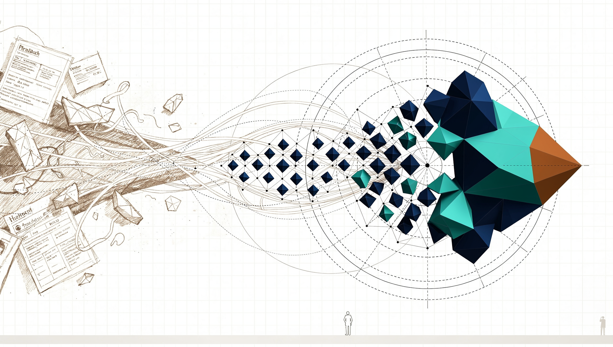

# datacrystal

[](https://github.com/semanticworks-gmbh/datacrystal/actions/workflows/ci.yml)
[](CHANGELOG.md)
[](.python-version)
[](LICENSE)

<p align="center">
  <picture>
    <source srcset="assets/hero.avif" type="image/avif">
    
  </picture>
</p>

**Your live objects are the database.** Define typed dataclasses, mutate them, call `commit()`.
datacrystal keeps the whole graph durable and queryable across restarts — same objects, same
identities, same references.

Every other path makes you *translate*: flatten your graph into tables (ORM), throw away your
types (JSON), or trust arbitrary code on load (pickle). datacrystal doesn't translate — your
data follows your code, no raindances.

**No ORM. No schema files. No `save()`. No pickle** — a record decodes straight back into your
objects, and decoding is structurally incapable of executing code.

```python
from typing import Annotated
import datacrystal as dc

@dc.entity
class Locality:
    qid: Annotated[str, dc.Unique]                # unique key  → store.get()
    name: str

@dc.entity
class Mineral:
    qid: Annotated[str, dc.Unique]
    name: str
    crystal_system: Annotated[str | None, dc.Index] = None   # bitmap index → store.query()
    type_locality: dc.Lazy[Locality] | None = None            # loads on first .get()

store = dc.Store.open("cabinet.store")
if store.root is None:                            # first run only — reruns find the data
    tsumeb = Locality(qid="Q571997", name="Tsumeb Mine")
    store.root = {"runs": 0, "minerals": [
        Mineral(qid="Q43010", name="quartz", crystal_system="trigonal"),
        Mineral(qid="Q193563", name="azurite", crystal_system="monoclinic",
                type_locality=dc.Lazy.of(tsumeb)),
    ]}
store.root["runs"] += 1                           # in-place mutation is tracked — no ORM
store.commit()                                    # no session, no dirty flags, no save() calls

hits = store.query(Mineral.crystal_system == "monoclinic")
print(sorted(m.name for m in hits))               # ['azurite']
print(store.root["runs"])                         # increments every run — it's a database
store.close()
```

## Why datacrystal

Three things a real build kept coming back to — each verifiable in the code:

**1. Persistence disappears.** Your `models.py` is just dataclasses. No session to open, no
dirty flags to manage, no `save()` to remember, no ORM mapping between two worlds. You mutate
Python objects and `commit()`; identity is preserved (`a.friend is b` survives a restart).
Schema, indexes and search config live *in the type* via `Annotated[...]`, so there's no
separate schema or migration file to drift out of sync.

**2. Predictable beats fast-but-mysterious.** Queries run through a rule-based planner you can
read with `explain()` — *"exactly two rules, never an optimizer"* (three, with sorted-range
indexes). You can always reason about why a query costs what it costs; nothing second-guesses
you. When you *want* a query optimizer, point DuckDB at the Arrow mirror — datacrystal stays
the predictable live tier.

**3. You draw the memory boundary.** Indexed reads cost `f(hits)`, never `f(extent)` — a
guarantee enforced as a CI fitness function. `Lazy[T]` is the explicit cut point: walk a graph
of any size and only the nodes on the path you follow hydrate (in the GLEIF proving ground, a
deepest-path walk over a 180,000-node ownership graph loads **10** of them). Cold data lives in
SQLite and faults in on first `.get()`; entities you drop are garbage-collected.

**4. A real database, not a pickle file.** Every commit is one atomic transaction —
all-or-nothing, durable, an exact prefix after any crash, never a torn write (a real `kill -9`
test gates this in CI). You get real transactional safety without ever leaving your objects.

## How it works

datacrystal (inspired by [EclipseStore](https://eclipsestore.io)) is that fourth path:
slots-dataclasses as the canonical form, [msgspec](https://jcristharif.com/msgspec/) msgpack
records (no `__reduce__`, no opcode interpreter — decoding can't run code),
[pyroaring](https://github.com/Ezibenroc/PyRoaringBitMap) bitmap indexes for queries, SQLite's
journal for crash safety, and one live instance per object — `a.friend is b` survives a restart.

## Works today (Python 3.14, 990+ tests)

**The model**
- Entities are plain typed dataclasses — mutate them, call `commit()`. No session, no `save()`.
- Identity preserved across restarts (`a.friend is b` survives reopen).
- Transparent dirty tracking, including in-place `list`/`dict` mutation.

**Query**
- Bitmap queries with a composable condition AST; `explain()` shows the plan.
- Decode-level `count()` / `pluck()` that build no entities.
- Sorted/range indexes — `>=`, `<`, `between`, `order_by` — with a persisted, watermark-validated index cache.
- Unique keys + `get()`; upsert by natural key; the reverse-reference index (`store.incoming()`).

**Graph**
- Lazy references and lazy adjacency — follow an edge, only the path you touch hydrates.

**Data lifecycle**
- Additive schema evolution: field renames, glue functions, and `migrate()`.
- Out-of-line binary blobs (`dc.Blob`) — read or written whole or streamed.
- Frozen (append-only) entities; unchecked `delete()`.

**Durability & crash safety**
- **Every commit is one atomic transaction** — all-or-nothing, never a torn write: after any crash you reopen to an *exact committed prefix*. A real `kill -9` test gates this in CI.
- **Durability is a policy you pick:** `commit` (fsync every commit — survives power loss) · `interval` (default — a process crash loses nothing; an OS crash may trim the last commits, never corrupts) · `never` (scratch/benchmarks).
- **Single-writer** (owner-confined + a process lease lock); readers get point-in-time **snapshot isolation** from any thread (bitmap queries included).
- Async stores (`aopen`); the COMMIT-DELTA-v1 watermark pipeline — locked contract + public conformance kit.

**Distribution**
- Edge followers: `Store.follower(url)` opens a **real local replica** that bootstraps from a single-writer coordinator, reads locally at full speed, and contributes writes back — optimistic-concurrency, fail-closed (`datacrystal[web]` coordinator + `datacrystal[follower]` client; `store.committing()` is the same read-modify-write on a single node or a follower).

**Three extras ride the pipeline**
- **`datacrystal[fts]`** — FTS5 full-text search, per-language Snowball stemming + BM25 over `dc.FullText` fields.
- **`datacrystal[arrow]`** — persistent Parquet mirrors → zero-copy Arrow tables for DuckDB/polars/pandas.
- **`datacrystal[web]`** — reflect `@entity` into FastAPI/Pydantic REST **and** Strawberry GraphQL (per-request DataLoader, no N+1).

**Not yet** (see the [roadmap](docs/design/ROADMAP.md)): vector search, an S3/object-store
backend, cross-mirror join recipes.

## Quick start

Not on PyPI yet — the name is reserved; publication follows the v0.1.0 line. Install straight
from GitHub:

```bash
# add it to your project (uv) — pin a release tag…
uv add "datacrystal @ git+https://github.com/semanticworks-gmbh/datacrystal@v0.7.0"
# …or track main
uv add "datacrystal @ git+https://github.com/semanticworks-gmbh/datacrystal@main"

# pip works the same way
pip install "datacrystal @ git+https://github.com/semanticworks-gmbh/datacrystal@v0.7.0"

# need an extra? name it in the brackets
uv add "datacrystal[web] @ git+https://github.com/semanticworks-gmbh/datacrystal@v0.7.0"
```

The example at the top is a complete program — run it twice and the data is still there.

**Or kick the tires in this repo:**

```bash
uv sync --all-extras
uv run python examples/minerals/demo.py   # run it twice — the data is still there
uv run pytest
```

## Learn it

- **[docs/GUIDE.md](docs/GUIDE.md) — the documentation**: the index into a
  [Diátaxis](https://diataxis.fr) split — a hand-held [Tutorial](docs/tutorial.md) (learn by
  doing), goal-oriented [How-to guides](docs/how-to/) (querying & paging, ingest & memory, schema
  evolution, blobs, web deployment, coordinator + edge followers, search, vector & hybrid search,
  analytics, snapshots & the delta log), a dry complete
  [Reference](docs/reference.md) (every method, option, guarantee, and error — with planned
  features clearly marked), and an [Explanation](docs/explanation.md) of the design *why*.
- [docs/design/](docs/design/) — design documents: [VISION.md](docs/design/VISION.md) (the
  "why"), [DESIGN.md](docs/design/DESIGN.md) (architecture),
  [ROADMAP.md](docs/design/ROADMAP.md) (scope authority),
  [KICKOFF.md](docs/design/KICKOFF.md) (engineering standards + the v0.1 execution record),
  the [ADRs](docs/design/) (ratified contract decisions),
  [SCALING.md](docs/design/SCALING.md), [NAME.md](docs/design/NAME.md) (the metaphor), and the
  adversarial reviews.
- [docs/research/](docs/research/) — per-topic evidence (EclipseStore internals, ZODB prior
  art, CPython mechanics with benchmarks, engine surveys).

## Contributing

datacrystal is maintained solo by Sven Hodapp; issues and small focused PRs are welcome. See
[CONTRIBUTING.md](CONTRIBUTING.md) for dev setup and the house rules, and
[docs/design/ROADMAP.md](docs/design/ROADMAP.md) for what is in and out of scope (the *Punted*
and *Never* lists). Per-release changes live in the [CHANGELOG](CHANGELOG.md).

Status: **0.7.0** — the API froze at the v0.1.0 baseline; v0.2–0.7 are purely additive.
PyPI publication deferred (names reserved). License: [MIT](LICENSE).
